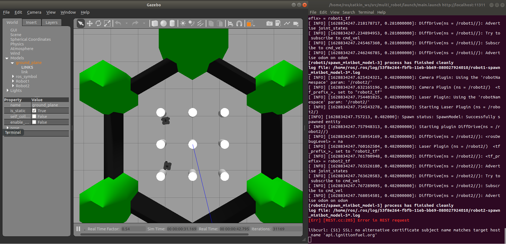
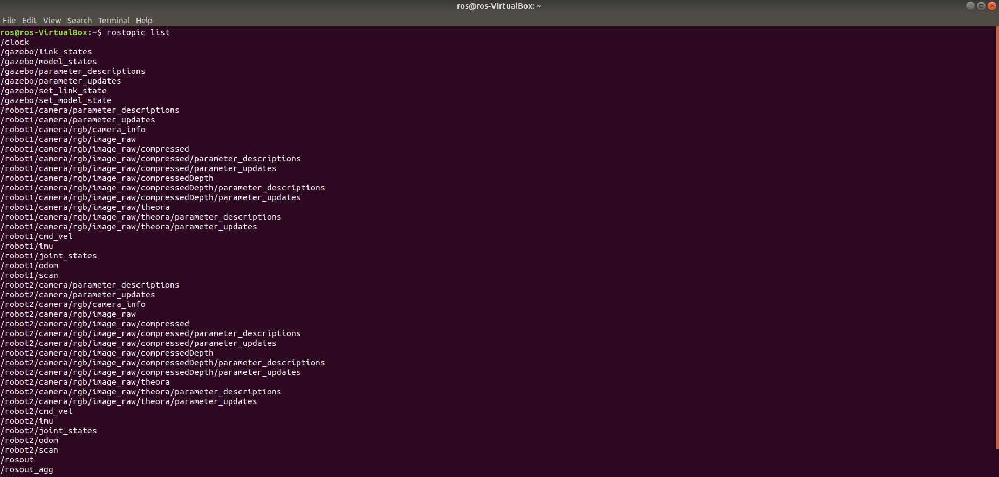
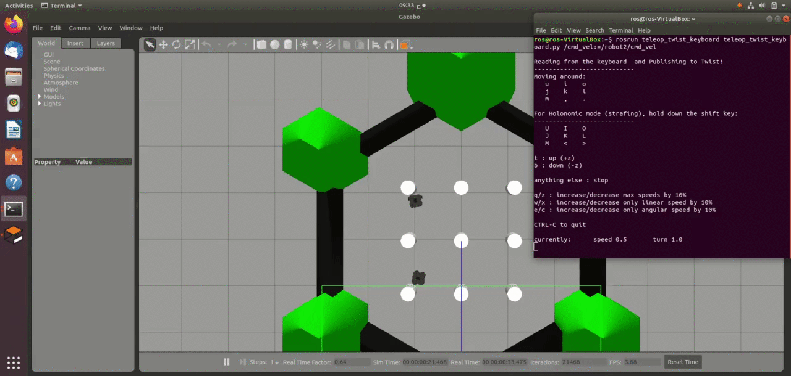

# Run-Multiple-Turtlebot3-Robots-on-Gazebo
Files of type ".launch" that runs multiple Turtlebot3 robots in gazebo and controlled using Teleop. 

## Running Process:
1. Make sure that ROS Melodic is installed in a virtual machine.
2. Create a workspace named catkin_ws (or another name, however, make sure to change the name in the next steps too!) following this link: http://wiki.ros.org/catkin/Tutorials/create_a_workspace 
3. Install TurtleBot3 Packages inside catkin_ws:
  ```
  $ git clone -b melodic-devel https://github.com/ROBOTIS-GIT/DynamixelSDK.git
  $ git clone -b melodic-devel https://github.com/ROBOTIS-GIT/turtlebot3_msgs.git
  $ git clone -b melodic-devel https://github.com/ROBOTIS-GIT/turtlebot3.git
  $ cd ~/catkin_ws && catkin_make
  $ echo "source ~/catkin_ws/devel/setup.bash" >> ~/.bashrc
  ```
4. Set TurtleBot3 Model Name (Waffle_pi):
  ```
  $ echo "export TURTLEBOT3_MODEL=waffle_pi" >> ~/.bashrc
  ```
5. Install Gazebo simulation package:
  ```$ cd ~/catkin_ws/src/
  $ git clone -b melodic-devel https://github.com/ROBOTIS-GIT/turtlebot3_simulations.git
  $ cd ~/catkin_ws && catkin_make
  ```
6. Create the multi_robot package:
  ```
  $ cd ~/catkin_ws/src
  $ catkin_create_pkg multi_robot std_msgs rospy roscpp gazebo_ros
  ```
7. clone the file "launch" in multi_robot:
  ```
  $ cd ~/catkin_ws/src/multi_robot
  $ git clone -b melodic-devel https://github.com/HebaAlkhorasani/Run-Multiple-Turtlebot3-Robots-on-Gazebo.git
  ```
8. Launch the project:
  ```
  $ roslaunch multi_robot main.launch
  ```
  the following Gazebo window must be displayed:
  
9. When using ```rostopic list``` these topics must be active:
  
10. Control the Two robots using teleop from two saperate terminals:
  ```
  $ rosrun teleop_twist_keyboard teleop_twist_keyboard.py /cmd_vel:=/robot1/cmd_vel
  ```
  ```
  $ rosrun teleop_twist_keyboard teleop_twist_keyboard.py /cmd_vel:=/robot2/cmd_vel
  ```
  
